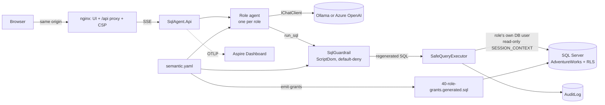

# Architecture

How a question becomes an answer, and which layer stops what. The row-level-security inventory is in
[rls-coverage.md](rls-coverage.md), the wire format in [sse-contract.md](sse-contract.md), the scoring method in
[../evals/README.md](../evals/README.md).

## Components

`SqlAgent.Core` owns everything that decides access (guardrail, executor, semantic layer, agent tools, evals) so the API and
the eval CLI run the same code. `SqlAgent.Api` is HTTP, auth and streaming. `semantic.yaml` is the single source for the
agent's schema tools, the guardrail allowlist and the generated database grants, so the three cannot disagree (CI fails if
the committed grants are stale).

## One question

1. The browser posts the question with a bearer token. The token's role and territory are the only source of identity.
2. The role's agent calls `list_tables` / `describe_tables` / `run_sql`. The tools are built per request and bound to the
   caller's role and territory; the model supplies only a table name, SQL and a purpose.
3. `run_sql` → guardrail → executor → database, as the role's own database user. Every call, refused or not, is audited.
4. The user sees the SQL, the full result and the answer. The model sees only as much of the result as
   `RESULT_VISIBILITY` allows.

## Three access layers

| Layer | Decides | Fails when |
|---|---|---|
| SQL guardrail | Which tables, columns, functions and syntax a query may use | A construct is allowed that should not be. Default-deny makes unknown syntax fail closed |
| Per-role database user | Which objects the connection can touch at all (`GRANT`/`DENY`, no `db_datareader`) | The generated grants drift from the allowlist (CI checks) |
| Row-level security | Which rows a `sales_rep` sees, by territory | A table carries territory data and has no predicate (see [rls-coverage.md](rls-coverage.md)) |

A query must pass all three. The database enforces the last two even if the guardrail had a bug.

## Guardrail rules

Every refusal carries one stable `ViolationCode`; the adversarial corpus
(`tests/SqlAgent.Core.Tests/Guardrails/adversarial-corpus.json`) asserts on these codes.

| Code | Refuses |
|---|---|
| `TooComplex` | Text over 5,000 characters, or nesting over 40 parentheses (the parser recurses per level) |
| `ParseError` | Text ScriptDom cannot parse |
| `MultipleStatements` | Stacked statements, `GO` |
| `NotASelect` | DML, DDL, `EXEC`, `WAITFOR`, `DECLARE`, anything but one `SELECT` (a leading CTE is fine) |
| `SelectInto` | `SELECT ... INTO` |
| `ForClause` | `FOR XML`, `FOR JSON` and other `FOR` clauses |
| `QueryHint` | Table and join hints, `OPTION (...)`, `COMPUTE` |
| `ForbiddenTableSource` | Functions, `OPENROWSET`/`OPENQUERY`, anything in `FROM` that is not a table, derived table or join |
| `TableNotAllowed` | A table outside the role's allowlist, a one-part name that is not a CTE in scope, views, temp tables. A denied and a missing table get the same reply |
| `CrossDatabaseName` | Three- and four-part names |
| `ForbiddenFunction` | Any function other than aggregate, window, string, date and math |
| `ForbiddenExpression` | Expression nodes off the allowlist: variables, `@@` globals, `NEXT VALUE FOR`, ... |
| `WildcardNotAllowed` | `*` and `t.*`, except inside `COUNT(*)` |
| `DeniedColumn` | A column the role may not read, anywhere it appears. Unqualified names are refused if any table in scope denies them |
| `UnknownColumnQualifier` | A qualifier that matches no table or alias in scope |
| `ForbiddenConstruct` | Any other syntax element not on the allowlist |

Approved queries are regenerated from the checked tree (so what was checked is what runs) and get `TOP (501)` when the
outermost query allows it.

## Executor and database limits

- 15 s command timeout, 500-row cap (`Truncated` is set when more exists), 2 MB result-size cap.
- The territory is set in a read-only `SESSION_CONTEXT` right after the connection opens; user SQL cannot change it.
- Resource Governor (`deploy/sql/45-resource-governor.sql`): `MAX_DOP = 1` (a hint cannot override it), 10 s CPU limit,
  10% memory-grant cap per reader.
- Per user: 10 requests a minute, one question at a time, 4 chats at once; per question: 6 model calls, 30 s of database
  time, and a stop after 3 failed queries in a row.

## Observability

One question is one trace in the Aspire Dashboard. Spans carry counts and codes only (no SQL text, rows, prompts or
answers unless content capture is switched on). Metrics are in meter `SqlAgent`. Details in the README.
